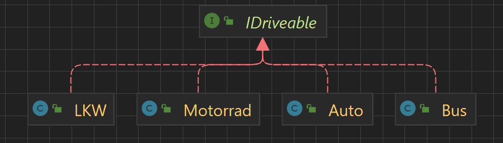

# LearnJava

### Ein Guide für die gängisten Aufgaben bei der Java Programmierung (in [IntelliJ IDEA Ultimate](https://www.jetbrains.com/de-de/idea/))

von Andreas Brandstetter (5AHEL HTL-Steyr)  
❗Dieses Dokument ist nicht vollständig und dient nicht als verifizierter Guide zur Java Programmierung. Es ist lediglich eine Hilfestellung für schulische Kollegen beim lernen.❗
<details>
  <summary>Inhaltsverzeichnis</summary>

- [Tipps & IntelliJ Shortcuts](#tipps--intellij-shortcuts)
    - [Alt+Enter](#alt--enter)
    - [IDE Features](#ide-features)
- [Java Basic](#java-basic)
- [Java Advanced](#java-advanced)
    - [Threads](#threads)
    - [Vererbung](#vererbung)
    - [Interfaces](#interfaces)
    - [Abstrakte Klassen](#abstrakte-klassen)
- [JavaFX Basic](#javafx-basic)
- [JavaFX Advanced](#javafx-advanced)
- [Dateioperationen](#dateioperationen)
- [JSON](#json)
- [JDBC](#jdbc)

</details>

Die einzelnen Themen sind in packages unterteilt welche sich im `src` Ordner befinden.

# Tipps & IntelliJ Shortcuts

## Alt + Enter

#### Beispiel Fehler: String zu Integer konvertierung

Der folgende Code ist **rot** markiert da versucht wird den Rückgabewert von .getText() _`String`_ in eine _`int`_
variable zu speichern, was natürlich nicht geht.


1. Wenn dir deine IDE etwas **rot** markiert ist es schlau als erstes den Code auf Tipp- und Klammerfehler zu prüfen.

2. Kannst du diese Fehler ausschließen solltest du als nächstes in Erwägung ziehen **mit der maus über den rot
   markierten Code zu fahren**  
   In den meisten Fällen weiß die IDE hier schon wo der Fehler liegt und zeigt diesen auch an.  
   

###### _In unserem Beispiel gibt es einen Fehler da der Inhalt eines TextFelds (String) nicht einfach in eine Integer variable gespeichert werden kann_

3. Weißt du aber nicht was du mit dieser Information anfangen sollst ist es hilfreich sich mit dem Cursor auf den rot
   markierten Code zu stellen und die Tastenkombination `Alt`+`Enter` zu drücken.  
   Hier kannst du dann im Kontext Menü die IDE die passendste Lösung anwenden lassen  
   

###### _Um das Problem nun endlich zu beseitigen wählst du den Vorschlag "Wrap using 'Integer.parseInt()'". Diese
Funktion der Integer Klasse wandelt den String in einen `int` Wert um_

Ergebnis:

```java
public void buttonClicked(ActionEvent actionEvent){

        int x=0;
        x=Integer.parseInt(textField.getText());

        }
```

## IDE features

### Woher weiß ich ob der Datentyp/die Klasse die ich gewählt habe die richtige ist?

Erklärt hier am Beispiel einer Dateioperation

```java
try{
        BufferedReader reader=new BufferedReader(new FileReader("test.txt"));
        // Create new Reader

        String string=reader.readLine();
        // do something with your String

        }catch(IOException e){
        e.printStackTrace();
        }
```

Woher weiß ich, dass der Wert, den ich von `reader().readLine();` zurückbekomme ein `String` ist?

Die Auto-Vervollständigung von IntelliJ zeigt rechts im Kontext Menü an, welcher Datentyp bei der jeweiligen Methode
zurück kommt, hier `String`.


# Java Basic

## Klassen

Eine Klasse ist der Bauplan für ein Objekt.

###### _Für diese Erklärung verwende ich als Klasse den Bauplan eines Bmw, und als Objekt das Auto selbst._

#### Der Klassische Aufbau einer Klasse sieht in fast allen Fällen folgendermaßen aus:

- Imports
- Klassenkopf
- Klassenvariablen
- Methoden

```java
public class Bmw {
    //Klassenvariablen
    static String companyName = "Bmw Group";
    String model;
    String engine;
    int seatCount;

    //Methoden
    private void printDetails() {
        System.out.println("This is a"model + "BMW , " + engine + "engine with " + seatCount + " seats");
    }

    private void drive() {
        System.out.println(modell + "Bmw fährt");
    }

}
```  

Wird ein Objekt dieser Klasse erstellt hat dieses alle Eigenschaften (Klassenvariablen) und Methoden die **NICHT**
statisch sind.

## Konstruktoren

Der Konstruktor erstellt/_konstruiert_ aus dem Bauplan, ein Objekt

###### Beispiel: mit `new` konstruiert man einen neuen Bmw aus dem Bauplan heraus.

Ein neues Objekt kann mit Verwendung von `new` erzeugt werden.

```java
Bmw bmw=new Bmw();
```

###### _`new`_ ruft den Konstruktor der Klasse Bmw auf

Ein Konstruktor kann gar keine

```java
   public Bmw(){
        }
```

bis alle Klassenvariablen beinhalten

```java
    public Bmw(String model,String engine,int seatCount){
        this.model=model;
        this.engine=engine;
        this.seatCount=seatCount;
        }
```

##### Auch hier gilt wieder, alle Klassenvariablen und Methoden die NICHT statisch sind!

###### Der Firmenname ist auch nicht in der Elektronik eines x-beliebigen Bmw definiert. Der Firmenname ist in einem Dokument in Büro des Chefs definiert

#### Beim erstellen des Objekts hat man dementsprechend auch die Auswahl welchen Konstruktor man verwendet


Unter der Annahme es existiert nur der erste Konstruktor in der Klasse müsste man also beim erstellen des Objekts alle
Daten angeben

```java
Bmw bmw=new Bmw("3er","V8",4);
```

## Methoden

Sind funktionen die beim Aufruf Code ausführen. Eine Methode kann einen Rückgabewert haben, muss aber nicht.

```java
    public String getModell(){
        String modell="3er";

        return modell;
        }
```

##### In diesem Fall gibt die Methode einen String zurück, also muss dies auch vor dem Namen der Methode definiert sein.

Methoden können auch Parameter entgegen nehmen, mit denen der Code den sie ausführen dann arbeitet. Eine Methode kann
beliebig viele Parameter entgegen nehmen.

Diese Methode z.B: nimmt den Modellnamen des Autos, fügt den übergebenen String hinten an und gibt das Ergebnis zurück.

```java
    private String addToName(String s){

        String str=modell+" "+s;

        return str;
        }
```

**In der Main Klasse wo die Methode aufgerufen wird sähe dies in etwa so aus:**

```java
        Bmw bmw=new Bmw("3er","V8",4);
        String s=bmw.addToName("test");

        System.out.println(s);
```

Das Ergebnis in der Konsole wäre: `3er test`

## Sichtbarkeit und Static

In Java gibt es 4 zustände die Variablen und Methoden annehmen können

- **default** _kein modifier_: Kann in der **selben Klasse**, im **selben Package** und in **Klassen die davon erben**
  verwendet werden
- **public**: Kann **überall** verwendet werden.
- **private**: Kann nur in der **selben Klasse** verwendet werden
- **protected**: Kann in der **selben Klasse** und in **Klassen im selben Package** verwendet werden.

### Static

Wenn eine Variable als `static` deklariert ist bedeutet das, egal wo die Variable geändert wird, ist der Wert immer
gleich
_Wenn also der Firmenname geändert wird heißt dass er ist überall geändert. Es macht auch keinen Sinn wenn Bmw ihren
Namen ändern würden, dass irgendwo anders die selbe Fabrik immer noch unter dem alten Namen läuft._

Methoden die Statisch deklariert sind können **NICHT** von einem Objekt aufgerufen werden, sondern nur von der Klasse
selbst. Auch kann keine Variable eines Objekts von einer statischen Methode aufgerufen werden.

```java
Bmw.changeCompanyName("BMW Alliance");
```

###### _Es macht keinen Sinn wenn jeder x-beliebige Bmw den namen der Firma ändern könnte._

###### _Genau so macht es keinen Sinn dass der Ceo der den Bauplan hat, das Modell eines x-beliebigen Bmw ändern
könnte._

# Java Advanced

## Threads

Threads in Java haben die Aufgabe, Code parallel zum Hauptprogramm auszuführen ohne dabei das Hauptprogramm zu
blockieren.  


Dies ist z.B: dann nützlich, wenn eine Chat App in einer Schleife neue Nachrichten abgefragen soll. Auf diese Weise kann
der Neben-Thread die schleife durchlaufen, und gleichzeitig das Hauptprogramm weitere Aufgaben ausführen.
---
### Threads in Java können auf 3 Arten erstellt werden:


### -Klasse extends Thread

Beispiel CountDown: Der Thread soll im Countdown Objekt die Sekunden herunterzählen.

In der Klasse selbst muss die run Methode aufgerufen werden


In die `run` kommt jeglicher Code der parallel ausgeführt werden soll  


##### Es wird empfohlen immer eine Abbruchbedingung der Schleife zu haben, und nicht einfach eine Endlosschleife bis zur beendung des Programms laufen zu lassen.

Um den Thread zu starten ruft man vom erstellten Objekt die start Methode auf.  


---

### -Klasse implements Runnable

Implementiert eine Klasse dieses Interface muss sie auch die `run` Methode implementieren.  


Genau wie oben, kommt hier der Code der parallel ausgeführt werden soll hinein.

Um den Thread zu starten muss die Klasse mit dem `Runnable` Interface in einen neuen Thread übergeben werden. Dieser
neue Thread kann dann wiederrum mit der `start()` Methode gestartet werden.  


---

### -Anonymer Thread

Ein anonymer Thread kann grundsätzlich an einer beliebigen Stelle im Programm erstellt werden.  
Dies sähe dann wie folgt aus:


Logik einbauen:  


Diesen Thread starten wir wiederrum direkt mit der `start()` Methode.  


###### ❗Außerdem ist es wichtig hinter der geschwungenen Klammer des Threads einen Strichpunkt zu setzen.

## Vererbung

Die Idee hinter Vererbung liegt darin, Eigenschaften und Methoden von einer Oberklasse _(Superklasse)_ für neue _
Unterklassen(Subklasse)_ zu verwenden. Beispiel verschiedene Fahrzeugtypen:

  
Egal ob Motorrad oder Auto, beides sind Fahrzeuge. Genauso sind beide, Audi Q8 und Tesla Model S, Autos.  
Ein Auto muss aber nicht zwingend ein Audi Q8 sein!  
Um die grundfunktionen eines motorisierten Fahrzeugs also nicht für jeden Typ neu schreiben zu müssen,
verwenden wir Vererbung.

Ein Audi Q8 hat dabei alle funktionen und Eigenschaften eines Autos, aber nicht umgekehrt❗ 
Ein Auto hat wiederrum alle Eigenschaften und Funktionen eines Fahrzeugs, ebenfalls aber nicht umgekehrt❗

Ein Tesla hat z.B seine eigenen funktionen + zusätzlich die von _Auto_ **und** _Fahrzeug_.


Praktisch verwenden wir vererbung dann folgendermaßen:

Subklasse `Auto` erbt von Superklasse `Fahrzeug`

### _extends_
Mit dem Schlüsselwort extends definieren wir, dass Auto von Fahrzeug erben soll.

"extends" + Superklasse (Fahrzeug)

```java
public class Auto extends Fahrzeug {
...
```

### _super_

Mit `super()` wird der Konstruktor der Superklasse aufgerufen, was im Klartext heißt: 
Beim erstellen von einem neuen Auto Objekt, erstellen wir unser Auto Objekt, 
mit all seinen Variablen und Methoden + die Variablen und Methoden der Klasse `Fahrzeug` vereint.


```java
public Auto(String farbe, int sitzAnzahl, int leistung, int tuerenAnzahl, String treibstoffTyp, int felgenGroesse) {
    
        super(farbe, sitzAnzahl, leistung);
        
        this.tuerenAnzahl = tuerenAnzahl;
        this.treibstoffTyp = treibstoffTyp;
        this.felgenGroesse = felgenGroesse;
    }
```
###### Im Konstruktor von Auto benutzen wir also super() genauso als würden wir ein neues Fahrzeug Objekt erstellen.


```java
//Fahrzeug fahrzeug = new Fahrzeug(farbe, sitzAnzahl, leistung)
Fahrzeug fahrzeug = new Fahrzeug("blau","5","150");
```

`super` kann aber auch anders verwendet werden:  
Um beispielsweise auf Methoden und Variablen der Superklasse zuzugreifen

```java
public void motorhaubeOeffnen() {
        System.out.println("Motorhaube vom Auto wird geöffnet");
        //brake() von Klasse Fahrzeug
        super.brake();
    }
```


**Auto:**
```java

package Java_Adv_Vererbung;


public class Auto extends Fahrzeug {

    //Klassenvariablen
    private int tuerenAnzahl = 0;
    private String treibstoffTyp = "";
    private int felgenGroesse = 0;

    //Konstruktor
    public Auto(String farbe, int sitzAnzahl, int leistung, int tuerenAnzahl, String treibstoffTyp, int felgenGroesse) {
        super(farbe, sitzAnzahl, leistung);
        
        this.tuerenAnzahl = tuerenAnzahl;
        this.treibstoffTyp = treibstoffTyp;
        this.felgenGroesse = felgenGroesse;
    }
    
}


```


## Interfaces

"Ein Interface ist eine Art vertrag" heißt, ein Interface hat die Aufgabe, dem Compiler garantieren zu können, dass
Klasse A eine bestimmte Methode beinhaltet.

An einem Beispiel erklärt:

Wir haben verschiedene Fahrzeugtypen: Autos, Motorräder, LKWs und Busse.



Ein Programm soll in der `testVehicleTopSpeed()` Methode verschiedene Typen von Fahrzeugen auf einem Prüfstand auf ihre
höchstgeschwindigkeit prüfen. Dazu muss das geprüfte Fahrzeug einfach nur gas geben, also in unserem Kontext
die `accelerate()` Methode aufrufen.

Hier stellen sich aber zwei Probleme:

- Wir müssen dem Compiler garantieren dass die übergebene Klasse die Methode `accelerate()` wirklich implementiert hat.
- Da wir verschiedene Fahrzeugtypen haben müssten wir für jeden Typ eine eigene Testmethode erstellen.

Beide Probleme lassen sich mit einem Interface relativ leicht beheben.

```java

import Java_Adv_Interfaces.Auto;
import Java_Adv_Interfaces.IDriveable;
import Java_Adv_Interfaces.Motorrad;

public class Main_Interfaces {

    public static void main(String[] args) {

        Auto auto = new Auto();
        Motorrad motorrad = new Motorrad();

        testVehicleTopSpeed(auto);

        testVehicleTopSpeed(motorrad);
    }

    static int testVehicleTopSpeed(IDriveable vehicle) {

        vehicle.accelerate();

    }

}
```

Anstelle von fixen Klassen, kann ein übergabeparameter einer Methode, oder eine Variable auch als Interface definiert
sein.

```java
void testVehicleTopSpeed(IDriveable vehicle){

    vehicle.accelerate();
    
}
        
    //oder
        
IDriveable vehicle1 = new Auto();
IDriveable vehicle2 = new Motorrad();

```

Also erstellen wir besagten Vertrag (***IDriveable***) für den Compiler und lassen jeden Fahrzeugtyp der fahrbar ist den
Vertrag "unterschreiben" `implements IDriveable`

Nun ist gewährleistet dass das Programm die `accelerate()` Methode jedes Fahrzeugtypen aufrufen kann, ohne für jeden Typ
unterschiedliche Logik einbauen zu müssen. Auf dem übergebenen Objekt `vehicle` kann aber nur die `accelerate()` Methode
aufgerufen werden und nicht die spezifischen Methoden die jede einzelne Klasse hat, denn das steht ja nicht im Vertrag!

## Abstrakte Klassen

# JavaFX Basic

### Setup für eine JavaFX Anwendung:

#### 1. Checken ob die richtige JDK eingestellt ist:

- Unter `File -> Project Structure -> SDK` eine JDK auswählen die funktioniert (nicht rot ist)
- Unter `File -> Project Structure -> Language Level` "SDK Default" auswählen

#### 2. JavaFX Libraries hinzufügen

- `File -> Project Structure -> Global Libraries` mit **"+"** *(Java)* alle JavaFx **.jar** dateien hinzufügen
- Diese liegen üblicherweise auf C:\Programme\ Java\ {sdk_version}\lib\


#### 3. In den Dependencies auf fehlerhafte Einträge prüfen

- `File -> Project Structure -> Modules -> {Projekt_Name} -> Dependencies`
- Sind in der Liste rote Einträge, lösch diese raus mit **"-"**


### Grafische Benutzeroberfläche (GUI):

#### Scene bauen:

Nachdem man alle FX Komponenten mit dem SceneBuilder dort hat wo man sie möchte:

- Ist es nie verkehrt, jeder Komponente eine fx:id zu geben
- Sollte man den Komponenten die etwas ausführen sollen eine '**OnAction**' _(oder andere arten von Aktionen
  hinzuzufügen)_

#### Scene mit Conrtoller verknüpfen:

Beispiel für eine Scene mit einem Label `helloLabel`, einem TextFeld `textField`, und einem Button `button`

```fxml
<AnchorPane prefHeight="400.0" prefWidth="600.0" xmlns="http://javafx.com/javafx/11.0.1" xmlns:fx="http://javafx.com/fxml/1" fx:controller="JavaFX_Basic.Controller">
        <Label fx:id="helloLabel" layoutX="60.0" layoutY="49.0" prefHeight="19.0" prefWidth="184.0" text="Hello"/>
        <TextField fx:id="textField" layoutX="60.0" layoutY="110.0"/>
        <Button fx:id="button" layoutX="60.0" layoutY="187.0" mnemonicParsing="false" onAction="#buttonClicked" text="Button"/>
</AnchorPane>
```

Damit die Scene weiß, wer sie steuert (Controller) muss dieser erstmal dazu gelinkt werden:

- Auf der untersten Schicht der Scene, hier die Anchorpane, muss ein Attribut `fx:controller="..."`fxml als Inhalt den
  Controller der Scene beinhalten. In diesem Fall "JavaFX_Basic.Controller", *Package:* `JavaFX_Basic` + `.` + *
  Klasse:* `Controller`

# JavaFX Advanced

# Dateioperationen

Darunter ist das lesen bzw. schreiben von- und zu dateien gemeint.

### Lesen

In Java lässt sich das lesen einer Datei recht unkompliziert mit einem `BufferedReader` 
bewerkstelligen,  
auf dem wir dann die readLine() methode aufrufen, um die Datei zu lesen

Der BufferedReader kann allerdings von selbst nicht lesen,  
weswegen wir ihm beim erstellen eine Klasse, die die Grundfunktionen dafür besitzt übergeben, beispielsweise einen `FileReader()`

> Der FileReader übernimmt die Hauptaufgabe des Lesens, Zeichen pro Zeichen aus der Datei heraus.  
> Der BufferedReader ist sozusagen eine Rüstung mit zusätzlichen Features, die dem FileReader angezogen wird. 
> Dadurch kann dann gleich eine ganze Zeile eingelesen werden, anstatt nur einzelnen Zeichen.
###### Also fast wie Tony Stark und seine Iron Man Suits. Tony ist mit Rüstung zwar stärker, die Rüstung alleine kann aber nichts ausrichten.


```java

    try {
        // Create new Reader
        BufferedReader reader = new BufferedReader(new FileReader("src/Datei_op/test.txt"));

        // Read with your reader
        string = reader.readLine();

        } catch (IOException e) {
        e.printStackTrace();
    }

```


### Schreiben

Der Ablauf zum schreiben in eine Datei funktioniert größtenteils genau gleich wie das Lesen. 
Mit dem kleinen aber feinen Unterschied dass hier neben der write() Methode, zusätzlich die append() Methode gibt,  
welche anstatt den Text in der Datei mit dem neuen Text zu ersetzen, den neuen Text einfach hinten an den alten Text dranhängt.


# JSON

# JDBC

Datenbank abfragen in Java mittels JDBC erfolgen immer in 4 einfachen Schritten

### 1. Connection aufbauen

Wir verwenden eine eigene Klasse `Database` die für das aufbauen der Verbindung zuständig ist. Dies hat den Vorteil dass
wir, um die Connection zu bekommen, nur eine Methode aufrufen müssen.

```java  
    public static Connection getInstance() {

        if (connection == null) {
            try {

                connection = DriverManager.getConnection("jdbc:" + type + "://" + host + ":" + port + "/" + database, user, password);
            } catch (SQLException e) {
                e.printStackTrace();
            }
        }

        return connection;
    }
```

###### _Dies hat den Vorteil, dass bei jedem aufruf der statischen Methode `getInstance()` wegen Singleton verfahren
immer die gleiche Connection verwendet wird._

Also holen wir uns die Connection dorthin wo wir sie brauchen

```java  
Connection connection = Database.getInstance();
```

### 2. Auf der Connection ein Statement definieren

Mit einem `PreparedStatement` definieren wir unsere Anfrage an die DB.

```java
PreparedStatement statement=connection.prepareStatement("SELECT * FROM tabellen_Name");
```

### 3. Statement ausführen und Antwort in ein ResultSet speichern

Das Statement wird mit der methode `executeQuery()` oder `executeUpdate()` an die DB geschickt.

```java
ResultSet resultSet=statement.executeQuery();
```  

###### _Die Methode `executeQuery()` wird ausschließlich zum ausführen von Statements mit Rückgabe "SELECT" verwendet.
Für andere Typen von SQL Statements wie "INSERT INTO", "UPDATE" und "DELETE" wird `executeUpdate()` verwendet._

#### ❗Wenn ein Abfragetyp ohne Rückgabe ("INSERT","UPDATE","DELETE") verwendet wird genügt es das Statement auszuführen mit `ececuteUpdate()`. Man muss dies nicht in ein ResultSet speichern. Der vierte Punkt fällt in diesem Fall weg❗

### 4. Daten aus dem ResultSet holen.

Wenn es sich aber um ein `SELECT` Statement handelt, d.h. wenn Daten zurückkommen müssen wir diese logischerweise noch
verarbeiten

#### Handelt es sich um ein Statement bei dem nur EINE Zeile zurückkommt reicht es das ResultSet einmal zu durchlaufen:

Mit `getString()` bzw. `getInt()` lassen sich bestimmte Daten aus dem Set herausholen

```java
if(resultSet.next()){
        System.out.println(resultSet.getString("variable"));
        }
```

#### Handelt es sich um ein Statement bei dem mehrere Datensätze zurückkommen muss das Set mehrmals durchlaufen werden:

```java
while(resultSet.next()){
        System.out.println(resultSet.getString("title"));
        }
```

### Zu guter letzt sollten Statement und ResultSet noch geschlossen werden. Hierfür gibt es die methode `close()` in beiden Klassen
